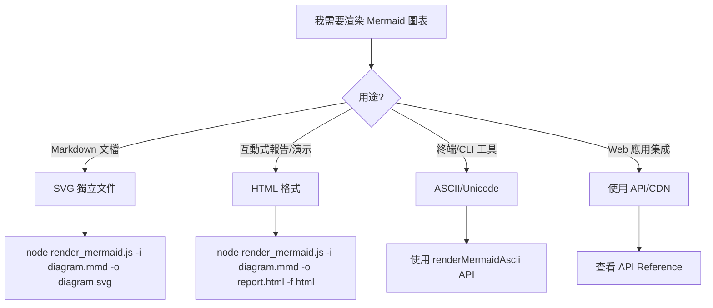

# Beautiful Mermaid

Render professional Mermaid diagrams with beautiful theming using the `beautiful-mermaid` package.

## Quick Decision Tree

### 你需要什麼輸出？



**選擇標準**：
- ✅ **SVG 獨立文件** - 單一圖表、嵌入 Markdown、版本控制友善
- ✅ **HTML 格式** - 多圖表報告、即時主題切換、互動式演示
- ✅ **ASCII/Unicode** - 終端輸出、最大兼容性、快速預覽
- ✅ **API/CDN** - 動態生成、Web 應用、程式化控制

## Quick Start

### 1. Check Environment

First, verify if beautiful-mermaid is installed:

```bash
node scripts/setup_check.js
```

If not installed, the script will guide you through installation options.

### 2. Render a Diagram

```bash
# Basic usage with default theme (tokyo-night)
node scripts/render_mermaid.js -i diagram.mmd -o output.svg

# With specific theme
node scripts/render_mermaid.js -i diagram.mmd -o output.svg -t nord

# As HTML with embedded SVG
node scripts/render_mermaid.js -i diagram.mmd -o output.html -f html

# Transparent background
node scripts/render_mermaid.js -i diagram.mmd -o output.svg --transparent
```

## User Stories: Real-World Usage Scenarios

### Story 1: 技術文檔維護者

**任務**：在 Wiki/README 中加入系統架構圖

**完整流程**：

1. **構思並編寫 Mermaid 程式碼**
   ```mermaid
   flowchart TD
       A[使用者請求] --> B{驗證 Token}
       B -->|有效| C[處理請求]
       B -->|無效| D[返回 401]
       C --> E[查詢資料庫]
       E --> F[返回結果]
   ```
   儲存為 `architecture.mmd`

2. **選擇主題** - 使用 `github-light` 以符合 GitHub 文檔風格

3. **渲染 SVG**
   ```bash
   node scripts/render_mermaid.js -i architecture.mmd -o architecture.svg -t github-light
   ```

4. **嵌入 Markdown**
   ```markdown
   ## 系統架構

   
   ```

5. **提交版本控制** - `.mmd` 和 `.svg` 都納入 git

**關鍵優勢**：SVG 可直接在 GitHub/GitLab 中顯示，無需額外渲染

---

### Story 2: 簡報製作人

**任務**：創建包含多個圖表的技術演示

**完整流程**：

1. **準備多個 .mmd 檔案**
   - `01-overview.mmd` - 系統概覽 (flowchart)
   - `02-sequence.mmd` - API 互動流程 (sequence)
   - `03-states.mmd` - 狀態轉換 (state diagram)

2. **批量渲染**（使用一致的主題）
   ```bash
   node scripts/render_mermaid.js -i 01-overview.mmd -o 01-overview.svg -t catppuccin-mocha
   node scripts/render_mermaid.js -i 02-sequence.mmd -o 02-sequence.svg -t catppuccin-mocha
   node scripts/render_mermaid.js -i 03-states.mmd -o 03-states.svg -t catppuccin-mocha
   ```

3. **組織進 HTML**（可選）
   ```html
   <!DOCTYPE html>
   <html>
   <head>
       <title>技術演示</title>
       <style>
           body { font-family: Inter, sans-serif; background: #1e1e2e; color: #cdd6f4; }
           section { margin: 40px 0; }
           img { max-width: 100%; }
       </style>
   </head>
   <body>
       <section>
           <h2>系統概覽</h2>
           
       </section>
       <section>
           <h2>API 互動流程</h2>
           
       </section>
       <section>
           <h2>狀態轉換</h2>
           
       </section>
   </body>
   </html>
   ```

4. **主題一致性建議**
   - 簡報用：`catppuccin-mocha`（溫暖）或 `dracula`（高對比）
   - 保持所有圖表使用相同主題
   - 使用 `--transparent` 選項讓圖表融入背景

---

### Story 3: Web 開發者

**任務**：在 React/Vue 應用中動態渲染圖表

**完整流程**：

1. **CDN 集成** - 查看 [api-reference.md](references/api-reference.md) 取得詳細說明

2. **API 調用範例**
   ```javascript
   import { renderMermaid } from 'beautiful-mermaid';

   const mermaidCode = `
   graph TD
       A[Start] --> B{Check}
       B -->|Yes| C[Process]
       B -->|No| D[End]
   `;

   const svg = await renderMermaid(mermaidCode, {
       theme: 'tokyo-night',
       fontFamily: 'Inter',
   });

   document.getElementById('diagram').innerHTML = svg;
   ```

3. **主題切換**
   ```javascript
   // 動態切換主題
   async function switchTheme(theme) {
       const svg = await renderMermaid(mermaidCode, { theme });
       document.getElementById('diagram').innerHTML = svg;
   }
   ```

4. **性能優化**
   - 使用快取避免重複渲染
   - 對於靜態圖表，在建置階段預渲染
   - 使用 `renderMermaidAscii` 作為快速預覽

**關鍵優勢**：程式化控制、動態主題、無需手動 CLI 操作

---

## Theme Selection Guide

Beautiful-mermaid 提供 **15 個內建主題**，適合各種使用情境：

| 主題名稱 | 色調 | 適用情境 |
|---------|------|---------|
| **tokyo-night** ⭐ | 深色 | 開發者文檔（預設） |
| **github-light** / **github-dark** | 淺/深 | GitHub 專案 |
| **zinc-light** / **zinc-dark** | 淺/深 | 企業正式報告 |
| **catppuccin-latte** / **catppuccin-mocha** | 淺/深 | 溫暖親和演示 |
| **nord-light** / **nord** | 淺/深 | 北極靈感、護眼 |
| **solarized-light** / **solarized-dark** | 淺/深 | 長時間閱讀 |
| **dracula** | 深色 | 高對比、鮮豔 |
| **one-dark** | 深色 | VS Code 用戶 |
| **tokyo-night-storm** / **tokyo-night-light** | 深/淺 | Tokyo Night 變體 |

**快速選擇**：
- 首次使用 → `tokyo-night`（預設）
- GitHub 專案 → `github-light` / `github-dark`
- 企業報告 → `zinc-light`
- 演示簡報 → `catppuccin-mocha` / `dracula`

📖 **完整主題指南**：查看 [themes.md](references/themes.md) 取得所有主題的詳細配色、決策樹和選擇建議。

---

## Diagram Types and Node Shapes

Beautiful-mermaid 支援 **5 種圖表類型** 和 **13 種 Node 形狀**：

**圖表類型**：
- Flowchart (`graph TD`) - 流程圖、決策樹
- State Diagram (`stateDiagram-v2`) - 狀態機、生命週期
- Sequence Diagram (`sequenceDiagram`) - API 互動、時序流程
- Class Diagram (`classDiagram`) - OOP 結構、類別關係
- ER Diagram (`erDiagram`) - 資料庫設計、實體關係

**常用 Node 形狀**：
- `[Rectangle]` - 一般步驟
- `(Rounded)` - 開始/結束
- `{Diamond}` - 決策點
- `[(Database)]` - 資料庫
- `[[Subroutine]]` - 子程序

**美化技巧**：
- 使用 `<br/>` 分行提升可讀性
- 使用 emoji 增加視覺吸引力（適度）
- 使用 `style` 命令自定義顏色

📖 **完整圖表指南**：查看 [diagram-types.md](references/diagram-types.md) 取得所有形狀語法、完整範例和最佳實踐。

---

## Installation Guide

### Global Installation

Available everywhere on the system:

```bash
npm install -g beautiful-mermaid
```

**Pros:** Works from any directory
**Cons:** May require sudo/admin, version conflicts possible

### Project Local

Installed in current project:

```bash
npm install beautiful-mermaid
```

**Pros:** Project-specific version, no conflicts
**Cons:** Only available in this project

### Using Alternative Package Managers

```bash
# pnpm
pnpm add beautiful-mermaid

# bun
bun add beautiful-mermaid
```

## Available Scripts

### `scripts/setup_check.js`

Checks if beautiful-mermaid is installed and lists available themes.

**Usage:**
```bash
node scripts/setup_check.js
```

**Output:**
- ✅ Package status
- List of available themes
- Installation guidance if needed

### `scripts/render_mermaid.js`

Main rendering engine.

**Options:**
- `-i, --input <file>` - Input Mermaid file (required)
- `-o, --output <file>` - Output file (required)
- `-t, --theme <name>` - Theme name (default: tokyo-night)
- `-f, --format <type>` - Format: 'svg' or 'html' (default: svg)
- `--transparent` - Transparent background
- `-h, --help` - Show help

**Examples:**

```bash
# Basic SVG
node scripts/render_mermaid.js -i flow.mmd -o flow.svg

# With theme
node scripts/render_mermaid.js -i state.mmd -o state.svg -t dracula

# HTML format
node scripts/render_mermaid.js -i seq.mmd -o report.html -f html -t github-light

# Transparent
node scripts/render_mermaid.js -i class.mmd -o class.svg -t nord --transparent
```

## Reference Documentation

### Themes

See [themes.md](references/themes.md) for:
- All 15 built-in themes with color specifications
- Theme selection guide by use case
- Custom theme creation
- Shiki integration

### Diagram Types

See [diagram-types.md](references/diagram-types.md) for:
- Complete syntax for all 5 diagram types
- Examples and best practices
- When to use each diagram type
- Accessibility tips

### API Reference

See [api-reference.md](references/api-reference.md) for:
- Complete API documentation
- TypeScript types
- Advanced usage patterns
- Browser integration
- Performance considerations

## Example Files

**基本範例**（5 個圖表類型）：
- `assets/examples/flowchart.mmd` - 認證流程
- `assets/examples/state.mmd` - 資料載入狀態
- `assets/examples/sequence.mmd` - API 快取流程
- `assets/examples/class.mmd` - OOP 繼承
- `assets/examples/er.mmd` - 電商資料庫

**進階範例**：
- `assets/examples/advanced-flowchart-subgraph.mmd` - 進階流程圖（使用 subgraph）
- `assets/examples/all-diagrams-showcase.html` - 完整主題展示頁面
- `assets/examples/multi-theme-demo.html` - 互動式主題切換示範
- `assets/examples/markdown-integration-example.md` - Markdown 整合範例

**工具腳本**：
- `assets/examples/batch-render.sh` - 批量渲染腳本（支援多檔案、進度顯示）

這些範例可作為模板或參考使用。

## Common Patterns

### Single Diagram in Markdown

1. Create Mermaid code
2. Save to `.mmd` file
3. Render to SVG
4. Embed in markdown artifact

```markdown
# System Architecture


```

### Multiple Diagrams in HTML

1. Create all Mermaid diagrams
2. Render each to SVG
3. Create HTML artifact with all SVGs embedded
4. Add context and explanations

### Interactive Presentation

1. Render with default theme
2. Embed in HTML with theme switcher
3. Use CSS custom properties for live switching

## Troubleshooting

### Package Not Found

**Error:** `beautiful-mermaid package not found`

**Solution:** Run `node scripts/setup_check.js` and follow installation guidance

### Invalid Mermaid Syntax

**Error:** `Parse error`

**Solution:** 
- Check syntax against diagram-types.md
- Test with simple example first
- Use example files as templates

### Theme Not Found

**Warning:** `Theme 'xyz' not found. Using tokyo-night.`

**Solution:** Check available themes with `setup_check.js` or see themes.md

### Node Not Found

**Error:** `command not found: node`

**Solution:** Install Node.js (minimum version 16+, recommended 18+)

## Tips for Best Results

1. **Start simple** - Test with basic diagram first
2. **Match theme to context** - Light for docs, dark for dev tools
3. **Keep focused** - One concept per diagram
4. **Use examples** - Reference assets/examples/ for patterns
5. **Iterate** - Show user, get feedback, refine
6. **Version control** - Keep `.mmd` source files in git
7. **Accessibility** - Choose high-contrast themes, use clear labels

## Quick Reference Card

本文件的快速導航：

- **快速開始** → 查看 [Quick Start](#quick-start)（環境檢查、基本渲染）
- **選擇輸出格式** → 查看 [Quick Decision Tree](#quick-decision-tree)（SVG、HTML、API）
- **選擇主題** → 查看 [themes.md](references/themes.md)（15 個主題完整說明）
- **選擇圖表類型** → 查看 [diagram-types.md](references/diagram-types.md)（5 種圖表完整語法）
- **API 使用** → 查看 [api-reference.md](references/api-reference.md)（程式化渲染）
- **整合指南** → 查看 [integration-guide.md](references/integration-guide.md)（React、Vue、CI/CD）
- **CLI vs API** → 查看 [cli-vs-api-guide.md](references/cli-vs-api-guide.md)（選擇建議）

**最常用的命令**：
```bash
# 檢查環境
node scripts/setup_check.js

# 基本渲染（預設 tokyo-night 主題）
node scripts/render_mermaid.js -i input.mmd -o output.svg

# 指定主題
node scripts/render_mermaid.js -i input.mmd -o output.svg -t github-light
```
