# Mermaid Diagram Types Reference

Complete guide to the 5 diagram types supported by beautiful-mermaid.

---

## 1. Flowcharts

**Use when:** Showing processes, decision trees, workflows, algorithms

**Syntax:** `graph` or `flowchart`

**Directions:**
- `TD` / `TB` - Top to bottom (default)
- `BT` - Bottom to top
- `LR` - Left to right
- `RL` - Right to left

### Basic Example

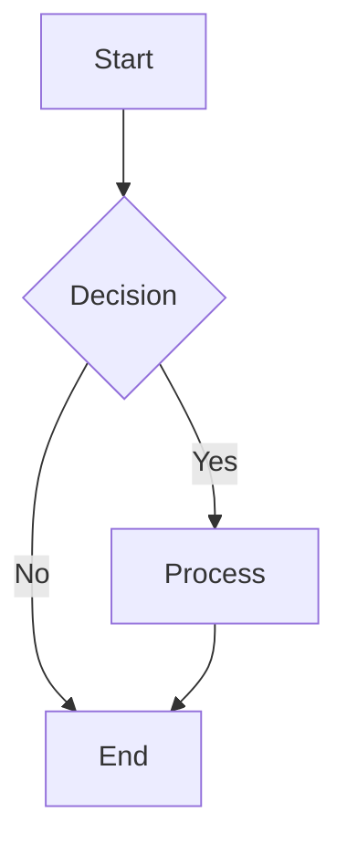

### Node Shapes

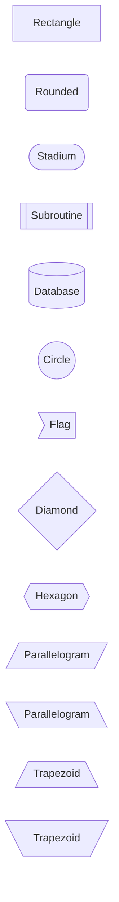

### Connection Types

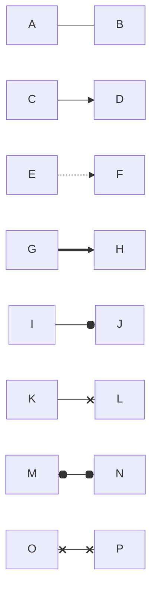

**Legend:**
- `---` Solid line
- `-->` Arrow
- `-.->` Dotted arrow
- `==>` Thick arrow
- `--o` Circle end
- `--x` Cross end
- `o--o` Double circle
- `x--x` Double cross

### Labels

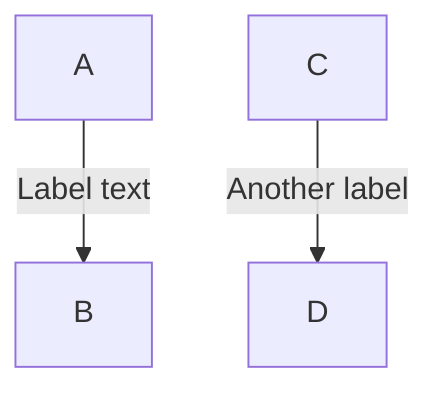

---

## Node Shapes Reference

Beautiful-mermaid 支援以下 13 種 node 形狀，每種都有特定的使用情境：

### 基本形狀

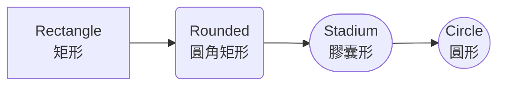

**使用建議**：
- **Rectangle** `[文字]` - 標準流程步驟、一般節點
- **Rounded** `(文字)` - 開始/結束點、強調節點
- **Stadium** `([文字])` - 子流程、模組
- **Circle** `((文字))` - 連接點、狀態節點

### 決策與流程

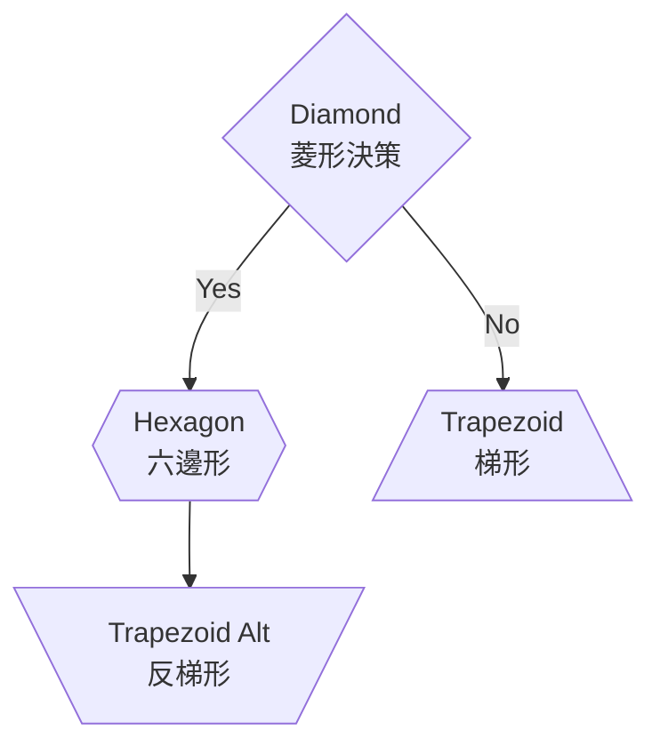

**使用建議**：
- **Diamond** `{文字}` - 決策點、條件判斷
- **Hexagon** `{{文字}}` - 準備/初始化步驟
- **Trapezoid** `[/文字\]` - 輸入、手動操作（寬底）
- **Trapezoid Alt** `[\文字/]` - 輸出（寬頂）

### 特殊用途

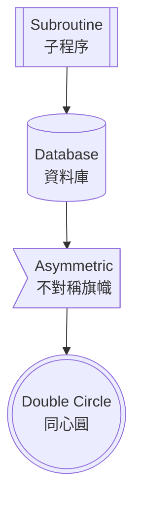

**使用建議**：
- **Subroutine** `[[文字]]` - 子程序、預定義流程
- **Cylinder** `[(文字)]` - 資料庫、資料存儲
- **Asymmetric** `>文字]` - 旗幟、不對稱標記
- **Double Circle** `(((文字)))` - 特殊狀態、結束標記

### 完整範例：美化的工作流程

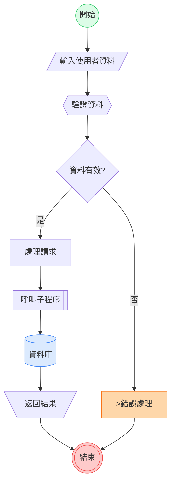

### 使用 HTML 標籤美化節點

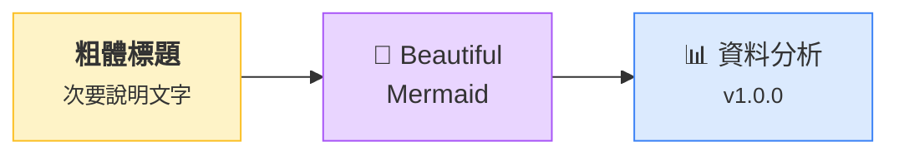

**進階技巧**：
- ✅ 使用 `<br/>` 來分行，提升可讀性
- ✅ 使用 `<small>` 添加次要資訊
- ✅ 使用 `<b>` 強調重要文字
- ✅ 使用 emoji 增加視覺吸引力（適度使用）
- ✅ 使用 `style` 命令自定義顏色

---

### Best Practices

1. **Keep it simple** - Max 10-12 nodes for clarity
2. **Consistent naming** - Use clear, descriptive labels
3. **Logical flow** - Top-down or left-right usually reads best
4. **Group related items** - Use subgraphs for organization
5. **Avoid crossing lines** - Reorganize nodes if lines overlap

---

## 2. State Diagrams

**Use when:** Modeling state machines, application states, lifecycle flows

**Syntax:** `stateDiagram-v2`

### Basic Example

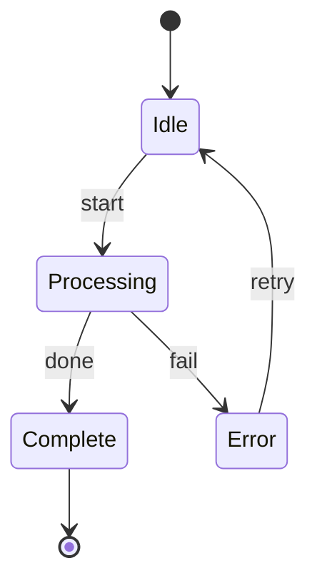

### States with Descriptions

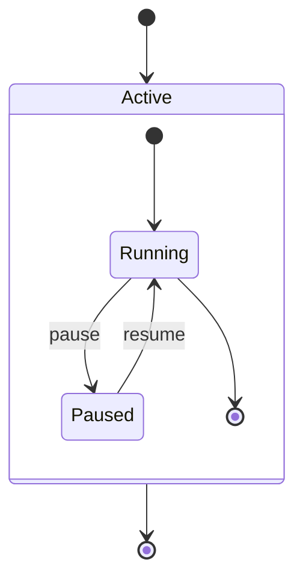

### Composite States

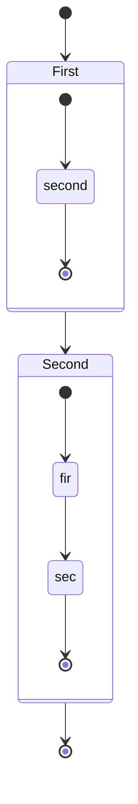

### Notes

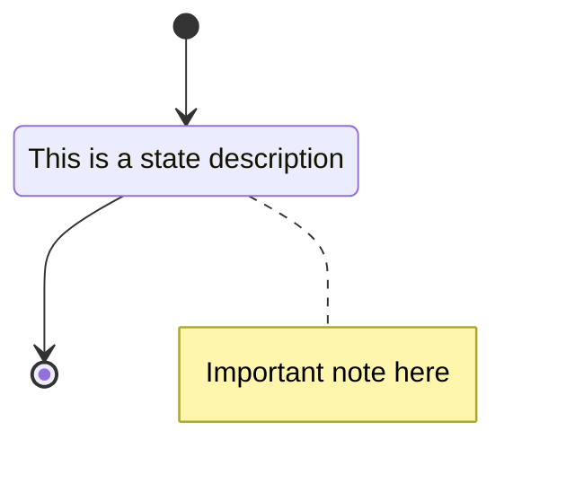

### Best Practices

1. **Start/End states** - Always use `[*]` for clarity
2. **Transition labels** - Be specific about triggers
3. **Composite states** - Group related states together
4. **Avoid cycles** - Or document them clearly
5. **Limit nesting** - Max 2-3 levels deep

---

## 3. Sequence Diagrams

**Use when:** Showing interactions over time, API calls, message passing

**Syntax:** `sequenceDiagram`

### Basic Example

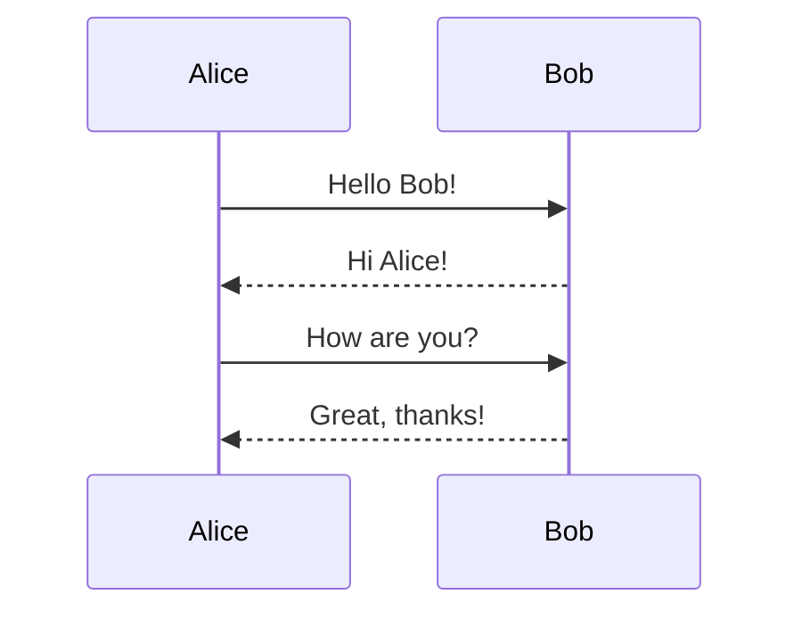

### Arrow Types

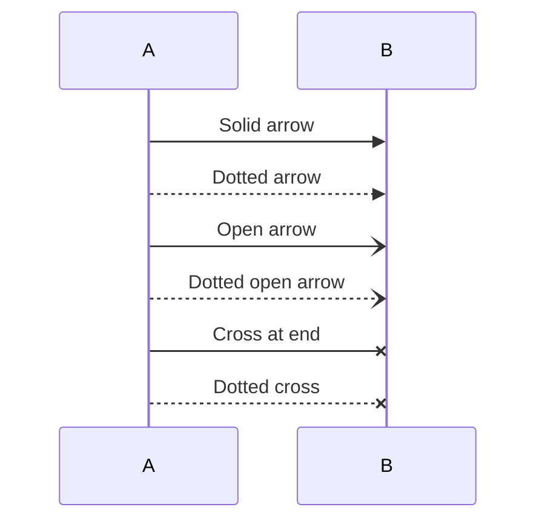

**Usage:**
- `->>`  Request/sync call
- `-->>`  Response
- `-)`  Async message
- `--)`  Async response
- `-x`  Lost message
- `--x`  Lost response

### Activation

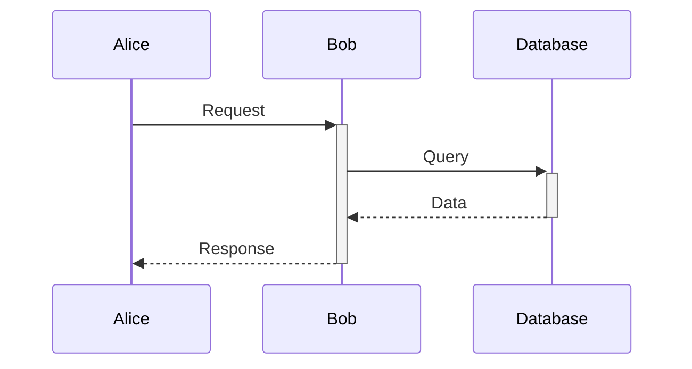

### Loops and Conditions

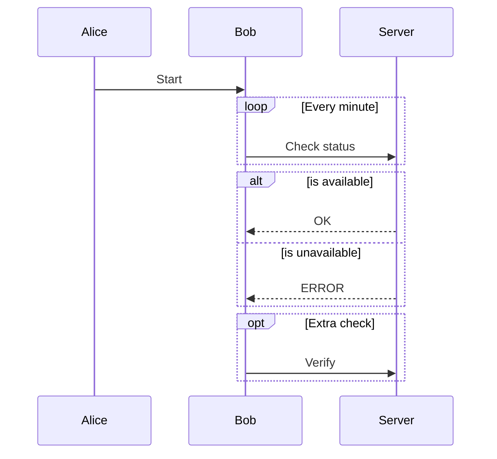

### Notes

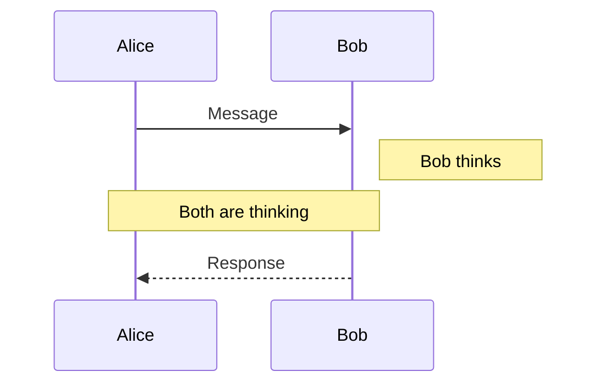

### Best Practices

1. **Order participants** - Left to right by importance
2. **Activation boxes** - Use `+` and `-` for clarity
3. **Group interactions** - Use alt/loop/opt appropriately
4. **Clear labels** - Describe what's being sent
5. **Limit participants** - 3-5 is ideal, max 7

---

## 4. Class Diagrams

**Use when:** Showing object-oriented structure, database schema, type systems

**Syntax:** `classDiagram`

### Basic Example

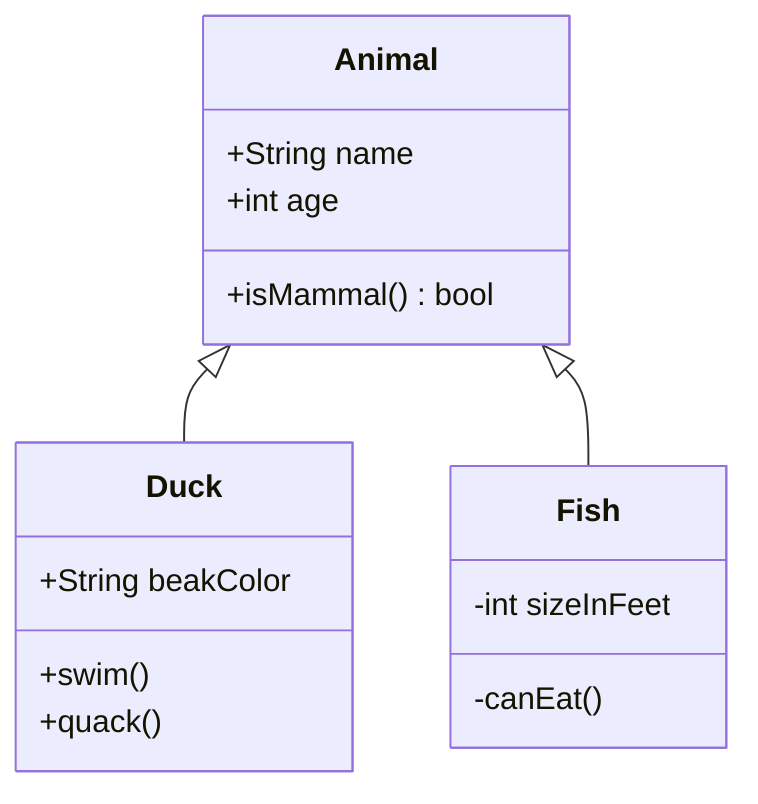

### Relationships

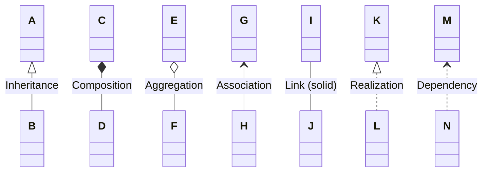

**Symbols:**
- `<|--` Inheritance
- `*--` Composition
- `o--` Aggregation
- `<--` Association
- `--` Link
- `<|..` Realization
- `<..` Dependency

### Visibility

```mermaid
classDiagram
    class MyClass {
        +public attribute
        -private attribute
        #protected attribute
        ~package attribute
        +publicMethod()
        -privateMethod()
    }
```

**Modifiers:**
- `+` Public
- `-` Private
- `#` Protected
- `~` Package/Internal

### Cardinality

```mermaid
classDiagram
    Customer "1" --> "*" Order
    Order "1" --> "1..*" LineItem
    LineItem "*" --> "1" Product
```

### Methods and Properties

```mermaid
classDiagram
    class BankAccount {
        +String owner
        +Bigdecimal balance
        +deposit(amount) bool
        +withdrawal(amount) int
    }
```

### Best Practices

1. **Group related classes** - Organize by layer/module
2. **Show key relationships** - Don't model everything
3. **Use cardinality** - Make relationships precise
4. **Visibility matters** - Use +/- appropriately
5. **Limit depth** - 1-2 levels of hierarchy ideal

---

## 5. Entity Relationship (ER) Diagrams

**Use when:** Designing databases, showing data models, relationship mapping

**Syntax:** `erDiagram`

### Basic Example

```mermaid
erDiagram
    CUSTOMER ||--o{ ORDER : places
    ORDER ||--|{ LINE_ITEM : contains
    PRODUCT ||--o{ LINE_ITEM : "is in"
```

### Relationship Types

```mermaid
erDiagram
    A ||--|| B : "one to one"
    C ||--o{ D : "one to many"
    E }o--o{ F : "many to many"
    G }|--|{ H : "one or more to one or more"
```

**Cardinality symbols:**
- `||` Exactly one
- `o|` Zero or one
- `}o` Zero or more
- `}|` One or more

### Attributes

```mermaid
erDiagram
    CUSTOMER {
        string name
        string email
        int customerId PK
    }
    ORDER {
        int orderId PK
        date orderDate
        int customerId FK
    }
    PRODUCT {
        int productId PK
        string name
        decimal price
    }
    
    CUSTOMER ||--o{ ORDER : places
    ORDER ||--|{ ORDER_ITEM : contains
    PRODUCT ||--o{ ORDER_ITEM : "ordered in"
```

**Attribute keys:**
- `PK` Primary Key
- `FK` Foreign Key

### Complete Example

```mermaid
erDiagram
    USER ||--o{ POST : creates
    USER ||--o{ COMMENT : writes
    POST ||--o{ COMMENT : has
    POST }o--o{ TAG : tagged
    
    USER {
        int userId PK
        string username
        string email
        datetime createdAt
    }
    
    POST {
        int postId PK
        int authorId FK
        string title
        text content
        datetime publishedAt
    }
    
    COMMENT {
        int commentId PK
        int postId FK
        int userId FK
        text content
        datetime createdAt
    }
    
    TAG {
        int tagId PK
        string name
    }
```

### Best Practices

1. **Naming conventions** - UPPERCASE for entities
2. **Show keys** - Always mark PK and FK
3. **Cardinality clarity** - Be precise with relationships
4. **Attribute types** - Include data types
5. **Normalize** - Follow database normalization rules

---

## Choosing the Right Diagram Type

| Diagram Type | Best For | Key Strength |
|-------------|----------|--------------|
| **Flowchart** | Processes, algorithms, workflows | Shows decision paths and flow |
| **State** | State machines, lifecycles | Models state transitions |
| **Sequence** | API interactions, message flow | Shows time-ordered interactions |
| **Class** | OOP structure, type systems | Shows relationships between classes |
| **ER** | Database design, data models | Shows entity relationships |

### Decision Tree

```
Need to show...
├─ A process or workflow? → Flowchart
├─ States and transitions? → State Diagram
├─ Interactions over time? → Sequence Diagram
├─ Class/object structure? → Class Diagram
└─ Database relationships? → ER Diagram
```

---

## General Best Practices

1. **Keep it focused** - One diagram, one concept
2. **Use consistent naming** - CamelCase, snake_case, whatever - be consistent
3. **Add context** - Use notes and comments when needed
4. **Test readability** - Can someone unfamiliar understand it?
5. **Iterate** - Diagrams evolve with understanding
6. **Export early** - Render and review in final format
7. **Version control** - Keep `.mmd` source files in git

---

## Accessibility Tips

1. **Don't rely on color alone** - Use labels and shapes
2. **Provide text alternatives** - Include descriptions
3. **High contrast** - Choose appropriate themes
4. **Font size** - Keep labels readable (beautiful-mermaid handles this)
5. **Simplify** - Less is more for clarity
