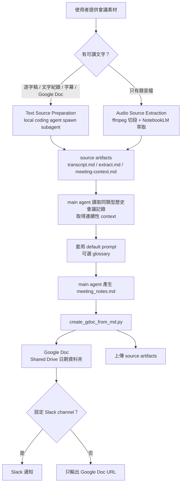

# Generate Meeting Notes 使用指南

`generate-meeting-notes` 會把會議逐字稿、文字紀錄、字幕檔或錄音整理成繁體中文會議記錄，並建立 Google Doc。

工程細節、local config 路徑、script input/output 與 stack 說明，見本文件的「技術流程」。

## 流程總覽



逐字稿與錄音兩種輸入都會先整理成同一組 source artifacts。逐字稿輸入由 local coding agent spawn subagent 產生 `transcript.md` 與 `extract.md`；錄音輸入由 NotebookLM source extraction 產生相同 artifacts。歷史會議記錄的主要用途是提供連續性 context，例如前次決策、待辦延續、專案背景、議題演進與術語脈絡；不是單純作為輸出格式範例。

## 適合誰用

- 非工程師：把檔案交給 Agent，請 Agent 安裝、設定、產出 Google Doc。
- 工程師：可以直接用 CLI 安裝與執行腳本。

## 請 Agent 安裝

如果你使用 Codex、Claude Code 或其他支援 Agent Skills 的工具，直接把這段話貼給 Agent：

```text
請幫我安裝這個會議記錄 skill。
請使用 Agent Skills CLI，從 https://github.com/fredrick84823/fstack 安裝 generate-meeting-notes。
安裝後請幫我完成第一次設定。
如果需要指令，請使用：
npx skills add https://github.com/fredrick84823/fstack --skill generate-meeting-notes --agent <目前 agent> -g -y
```

如果你不知道 agent 名稱，請貼這句：

```text
我不知道目前 agent 名稱，請幫我判斷環境並安裝 generate-meeting-notes。
```

常見指令：

```bash
# Codex
npx skills add https://github.com/fredrick84823/fstack --skill generate-meeting-notes --agent codex -g -y

# Claude Code
npx skills add https://github.com/fredrick84823/fstack --skill generate-meeting-notes --agent claude-code -g -y
```

## 第一次設定

安裝後請對 Agent 說：

```text
請幫我完成 generate-meeting-notes 的第一次設定。
```

預設第一次設定會準備逐字稿/文字紀錄 source preparation 與 main synthesis，包含：

- `uv`
- Google Cloud CLI / Google Drive 認證
- Slack token 與會議類型設定

如果你需要處理錄音檔，請另外對 Agent 說：

```text
請幫我啟用 generate-meeting-notes 的錄音檔支援，執行 setup.py --with-audio。
```

錄音檔支援才會檢查 `ffmpeg`、Playwright Chromium 與 NotebookLM 登入。

## 支援的輸入

優先使用文字來源；沒有文字時才用 Audio Source Extraction 把錄音先萃取成文字來源。兩種輸入最後都會先形成 `transcript.md`、`extract.md`、`meeting-context.md`，再由 main agent 產生正式會議記錄。

| 類型 | 常見副檔名 | 使用方式 |
|------|------------|----------|
| 逐字稿 / 文字紀錄 | `.txt`, `.text`, `.md`, `.markdown`, `.csv` | Agent spawn subagent 產出 source artifacts |
| 字幕檔 | `.srt`, `.vtt` | Agent spawn subagent 產出 source artifacts |
| 文件型文字紀錄 | `.docx`, `.pdf`, Google Doc | 先請 Agent 讀取或轉成文字/Markdown |
| 音訊檔 | `.m4a`, `.mp3`, `.wav`, `.aac`, `.flac`, `.ogg`, `.opus` | 先走 Audio Source Extraction，再回到 Main Synthesis |
| 含音軌媒體檔 | `.mp4`, `.mov`, `.mkv`, `.webm` | 建議先抽出音訊；若 `ffmpeg` 可讀也可嘗試直接處理 |

Plaude 只是常見來源之一，不是必要條件。

## 流程選擇

### 1. Text Source Preparation + Main Synthesis

適合已經有逐字稿、文字紀錄、字幕檔或 Google Doc 的情境。

請對 Agent 說：

```text
請用 generate-meeting-notes 處理這份逐字稿，產生 Google Doc 會議記錄。
檔案是：<檔案路徑或 Google Doc 連結>
會議類型是：<會議類型>
```

實際運作：

1. Main agent 確認逐字稿路徑、會議類型與日期。
2. Main agent 建立 `/tmp/meeting_sources/<meeting_key>_<YYYYMMDD>/`。
3. Main agent spawn source-preparation subagent。
4. Subagent 只根據文字輸入產出 `transcript.md` 與 `extract.md`。
5. Main agent 產出 `meeting-context.md`。
6. Main agent 讀取 source artifacts、default prompt 與同類型歷史會議記錄作為連續性 context，產生正式 `meeting_notes.md`。
7. Agent 執行 `create_gdoc_from_md.py --source-dir <RESULT_SOURCE_DIR>` 建立 Google Doc，並把 source artifacts 上傳到同一個日期資料夾。
8. 若設定了 Slack channel，會發送通知。

`extract.md` 是本次逐字稿的議題、決策、行動項目、風險與待確認事項索引。它必須只根據 `transcript.md` 產生；歷史會議記錄只提供連續性 context，不能補成本次會議事實。

### 2. Audio Source Extraction

適合只有錄音檔、沒有逐字稿的情境。

請對 Agent 說：

```text
請用 generate-meeting-notes 處理這個錄音檔。
檔案是：<音訊檔路徑>
會議類型是：<會議類型>
```

注意：音訊檔名必須包含連續 8 位日期，例如 `data_meeting_20260605.m4a`。Audio Source Extraction 目前不會從 `2026-06-05` 這種格式自動推斷日期。

實際運作：

1. 腳本用 `ffmpeg` 切音訊片段。
2. 上傳到指定 NotebookLM Notebook。
3. 等 NotebookLM 處理音訊 source。
4. 腳本輸出 `transcript.md`、`extract.md`、`meeting-context.md`。
5. Main agent 讀取 source artifacts、default prompt 與歷史會議記錄作為連續性 context，產生正式 Markdown 會議記錄。
6. Agent 執行 `create_gdoc_from_md.py --source-dir <RESULT_SOURCE_DIR>` 建立 Google Doc，並把 source artifacts 上傳到同一個日期資料夾。
7. 若設定了 Slack channel，會發送通知。

Audio Source Extraction 不會直接採用 NotebookLM Studio report 當正式會議記錄，因為 report 容易漏細節，也可能混入 Notebook 的既有脈絡。正式會議記錄以 `transcript.md` 為主證據，`extract.md` 只作為索引與 checklist。

### 3. 雙來源合併工作流

適合同時有逐字稿與錄音檔的情境。

建議先用逐字稿 source artifacts 產生主版本；只有在逐字稿缺漏明顯時，再用 Audio Source Extraction 產生 source artifacts 補充。合併時仍以逐字稿與音訊 transcript 可支持的內容為準。

## Glossary 專有名詞表

可選。用途是改善人名、專案名、縮寫與常見誤聽字，不是用來補會議事實。

第一次設定時，`setup.py` 會把 `glossary_path` 寫進設定檔，並在檔案不存在時自動建立空範本。建立後，setup 會再詢問你是否要立刻新增幾筆 glossary terms：

```json
{
  "global_terms": [],
  "meeting_terms": {}
}
```

需要新增詞彙時，可請 Agent 協助編輯：

```text
請幫我建立 generate-meeting-notes glossary.json，用來修正人名、專案名和縮寫。
```

詞彙基本格式：

```json
{
  "global_terms": [
    {
      "id": "mcp",
      "canonical": "MCP",
      "aliases": ["NCP", "Model Context Protocol"],
      "type": "technical_term",
      "status": "active",
      "render_hint": "保留大寫 MCP",
      "disambiguation": "只作為術語修正，不補充會議事實"
    }
  ],
  "meeting_terms": {
    "team週會": [
      {
        "id": "project-x",
        "canonical": "Project X",
        "aliases": ["PX"],
        "type": "project",
        "status": "active"
      }
    ]
  }
}
```

## 常見問題

- **我不是工程師，要怎麼開始？**
  把「請 Agent 安裝」那段話貼給你的 Agent，讓 Agent 代你處理。

- **我只有 Google Doc 逐字稿，可以用嗎？**
  可以。請 Agent 讀取或匯出 Google Doc 內容，再走 Text Source Preparation + Main Synthesis。

- **我只有錄音，可以用嗎？**
  可以，但要先請 Agent 啟用錄音檔支援：`setup.py --with-audio`。實際正式稿仍由 Agent 讀取萃取出的文字來源後產生。

- **會自動辨識所有人名嗎？**
  不保證。若逐字稿或 NotebookLM 只留下 `Speaker 1` 之類標籤，Agent 會保留標籤，除非你提供明確對照。

- **glossary 會不會亂補內容？**
  不應該。glossary 只用於名稱和縮寫修正，不應補出 transcript 沒有講過的決策、數字或待辦。

---

## 技術流程


這份文件說明 `generate-meeting-notes` 會用到的 stack、local config 位置、script input/output，以及文字與錄音兩種輸入如何匯入同一個 source artifact pipeline。

## Stack

### Agent runtime

- Agent Skills CLI：安裝 skill 到 Codex、Claude Code、Gemini CLI、OpenCode 等 agent。
- Local coding agent：負責讀取 input、spawn source-preparation subagent、讀歷史會議 context、產生 `meeting_notes.md`。
- Subagent / Task 能力：文字輸入路徑用來產生 `transcript.md` 與 `extract.md`。若 runtime 不支援 subagent，main agent 可代行，但仍要先產出 artifacts。

### Python runtime

- `uv`：建立 `.venv`、安裝 Python dependencies、執行 bundled scripts。
- Python `>=3.12`。
- `google-api-python-client` / `google-auth` / `google-auth-oauthlib`：Google Drive / Docs API。
- `slack-sdk`：Slack 通知。
- `notebooklm-py[browser]`：錄音輸入才需要，用來操作 NotebookLM。
- Python Playwright browser runtime：錄音輸入才需要；`uv run playwright install chromium` 會安裝 Chromium 給 `notebooklm-py` 使用。這不是 Playwright MCP server。

### External tools and services

- `gcloud`：取得 Google Application Default Credentials，並用 `--enable-gdrive-access` 讓 Drive API 可用。
- Google Drive / Google Docs：建立日期資料夾、建立正式 Google Doc、上傳 source artifacts。
- Slack：可選；設定 `slack_channel` 與 `slack_bot_token` 後自動通知。
- `ffmpeg`：錄音輸入才需要，用來切音訊。
- NotebookLM：錄音輸入才需要，用來把音訊 source 萃取成 `transcript.md` 與 `extract.md`。

## Local State

### Skill 安裝位置

Agent Skills CLI 會把 skill 目錄複製到 agent 的 skills directory。常見位置：

| Agent | 常見安裝目錄 |
|---|---|
| Codex | `~/.agents/skills/generate-meeting-notes/` 或 `~/.codex/skills/generate-meeting-notes/` |
| Claude Code | `~/.claude/skills/generate-meeting-notes/` |
| Gemini CLI | `~/.gemini/skills/generate-meeting-notes/` |
| OpenCode | `~/.opencode/skills/generate-meeting-notes/` |

實際執行 script 前，Agent 應先解析 `SKILL_DIR`，不要 hardcode 本機絕對路徑。

### Config 目錄

所有使用者設定都放在：

```text
~/.config/generate-meeting-notes/
```

目前會建立：

| Path | 建立時機 | 用途 |
|---|---|---|
| `~/.config/generate-meeting-notes/config.json` | `scripts/setup.py` | 會議類型、Drive folder、Slack、prompt/glossary path |
| `~/.config/generate-meeting-notes/prompt.md` | `scripts/setup.py` 第一次執行時複製 | 使用者可編輯的 default prompt |
| `~/.config/generate-meeting-notes/glossary.json` | `scripts/setup.py` 發現不存在時建立 | 名稱、縮寫、人名、專案名修正；不可作為會議事實來源 |

`setup.py` 不會覆蓋既有 `prompt.md` 或 `glossary.json`。

### Google credentials

Google ADC 通常由 `gcloud auth login --enable-gdrive-access --update-adc` 建立在：

```text
~/.config/gcloud/application_default_credentials.json
```

這是 Google client library 透過 `google.auth.default()` 讀取的 credentials。

### Runtime artifacts

每次會議的 source artifacts 建議放在：

```text
/tmp/meeting_sources/<meeting_key>_<YYYYMMDD>/
```

固定檔名：

```text
transcript.md
extract.md
meeting-context.md
```

正式稿中間檔建議放在：

```text
/tmp/meeting_notes_<meeting_key>_<YYYYMMDD>.md
```

發布後，`create_gdoc_from_md.py --source-dir ...` 會把 source artifacts 上傳到同一個 Google Drive 日期資料夾。

## Config Schema

`config.json` 範例：

```json
{
  "slack_bot_token": "xoxb-...",
  "meetings": {
    "team週會": {
      "notebook_name": "Team 會議記錄",
      "folder_id": "1EXAMPLE_FOLDER_ID...",
      "folder_name": "team-meetings",
      "series_name": "Data內會",
      "slack_channel": "C0XXXXXXXXX",
      "attendees": ["Alice", "Bob"],
      "custom_prompt": "本次會議報告順序固定如下..."
    }
  },
  "prompt_path": "~/.config/generate-meeting-notes/prompt.md",
  "glossary_path": "~/.config/generate-meeting-notes/glossary.json"
}
```

欄位用途：

| Field | 傳遞方式 | 用途 |
|---|---|---|
| `slack_bot_token` | `send_slack_notification.py` 讀取 config | 發 Slack 通知 |
| `meetings.<key>.folder_id` | `create_gdoc_from_md.py --meeting <key>` 查 config | Shared Drive 父資料夾 |
| `meetings.<key>.folder_name` | `create_gdoc_from_md.py` 查 config | Slack 顯示路徑 |
| `meetings.<key>.series_name` | `create_gdoc_from_md.py` 查 config | Google Doc 命名 |
| `meetings.<key>.slack_channel` | `create_gdoc_from_md.py` 查 config | 通知目標 channel |
| `meetings.<key>.attendees` | `create_gdoc_from_md.py` 查 config | 發布前注入「與會者」欄位 |
| `meetings.<key>.custom_prompt` | main agent / `meeting-context.md` | 會議類型補充脈絡 |
| `meetings.<key>.notebook_name` | `extract_audio_sources.py --meeting <key>` 查 config | 錄音輸入的 NotebookLM notebook |
| `prompt_path` | main agent 讀取 | 成稿 prompt |
| `glossary_path` | main agent / `extract_audio_sources.py` 讀取 | naming-only glossary |

`glossary.json` 空範本：

```json
{
  "global_terms": [],
  "meeting_terms": {}
}
```

有效 entries 會從 `global_terms` 與 `meeting_terms.<meeting_key>` 合併，且只使用 `status = active` 的項目。

## Script Flow

### 1. setup.py

執行：

```bash
cd "$SKILL_DIR" && uv run scripts/setup.py
```

預設設定文字輸入與 main synthesis：

1. 檢查或安裝 `uv`。
2. 檢查 `gcloud`。
3. `uv sync` 安裝 Python dependencies。
4. 略過 Playwright Chromium 與 NotebookLM login。
5. 檢查 Google Drive 認證。
6. 建立 `~/.config/generate-meeting-notes/`。
7. 複製 `references/default-prompt.md` 到 `prompt.md`，若已存在則保留。
8. 建立 `glossary.json` 空範本，若已存在則保留。
9. 互動式寫入 meeting config。
10. 可選：互動式新增 glossary terms（global 或指定 meeting type）。
11. 驗證 config 可讀。

錄音支援：

```bash
cd "$SKILL_DIR" && uv run scripts/setup.py --with-audio
```

除了上述流程，還會：

- 檢查或安裝 `ffmpeg`。
- 執行 `uv run playwright install chromium`。
- 執行 NotebookLM auth check；未登入時執行 `uv run notebooklm login`。
- 在 meeting config 中詢問 `notebook_name`。

### 2. Text Source Preparation

文字輸入沒有專用 Python script。這段由 local coding agent orchestration 完成。

Input：

- 使用者提供的逐字稿、字幕檔、文字紀錄、或已匯出的 Google Doc 文字。
- `meeting_key`。
- `YYYYMMDD` 日期。
- `~/.config/generate-meeting-notes/config.json`。
- `glossary_path` 指向的 glossary。

main agent 建立 artifact directory：

```bash
mkdir -p /tmp/meeting_sources/<meeting_key>_<YYYYMMDD>
```

main agent spawn source-preparation subagent。subagent 只輸出：

```text
/tmp/meeting_sources/<meeting_key>_<YYYYMMDD>/transcript.md
/tmp/meeting_sources/<meeting_key>_<YYYYMMDD>/extract.md
```

`transcript.md`：

- 主事實來源。
- 保留原始 speaker label、時間戳、語意順序。
- 只做輕量格式整理，不補寫會議事實。

`extract.md`：

- 只根據 `transcript.md` 產生議題、決策、行動項目、風險、open questions、待確認事項索引。
- 每個重要項目盡量留下 speaker label、時間戳或原文短語。
- 不能引用歷史記錄或 glossary 補成本次會議事實。

main agent 再產生：

```text
/tmp/meeting_sources/<meeting_key>_<YYYYMMDD>/meeting-context.md
```

`meeting-context.md` 包含：

- `meeting_key`
- `series_name`
- `attendees`
- `custom_prompt`
- active glossary entries
- input source path
- date

### 3. Audio Source Extraction

執行：

```bash
cd "$SKILL_DIR" && uv run scripts/extract_audio_sources.py \
  <audio_file_path> \
  --meeting <meeting_key> \
  --delete-segments \
  --segment-count 20
```

Input 傳遞：

| Input | 來源 |
|---|---|
| `<audio_file_path>` | CLI positional argument |
| `--meeting <meeting_key>` | CLI option |
| `notebook_name` | 從 `config.json` 的 `meetings.<meeting_key>.notebook_name` 讀取 |
| `glossary_path` | 從 `config.json` 讀取 |
| `custom_prompt` / `attendees` | 從 `config.json` 讀取並寫入 context |

主要步驟：

1. 從音訊檔名解析連續 8 位 `YYYYMMDD`。
2. 載入 config，驗證 `meeting_key` 存在。
3. 載入 active glossary entries。
4. 用 `ffmpeg` 切音訊片段。
5. 上傳片段到 `notebook_name` 對應的 NotebookLM notebook。
6. 等 NotebookLM 處理 source。
7. 從 source fulltext / source-scoped chat 產生 `transcript.md`。
8. 從 source-scoped chat 產生 `extract.md`。
9. 產生 `meeting-context.md`。
10. 可選清理本地音訊切片。

Output：

```text
RESULT_TRANSCRIPT: /tmp/meeting_sources/<meeting_key>_<date>/transcript.md
RESULT_EXTRACT: /tmp/meeting_sources/<meeting_key>_<date>/extract.md
RESULT_CONTEXT: /tmp/meeting_sources/<meeting_key>_<date>/meeting-context.md
RESULT_SOURCE_DIR: /tmp/meeting_sources/<meeting_key>_<date>
RESULT_SERIES_NAME: <series_name>
RESULT_DATE: <YYYYMMDD>
```

### 4. Main Synthesis

Main Synthesis 不是 Python script；它是 main agent 的成稿步驟。

Input：

- `RESULT_TRANSCRIPT`
- `RESULT_EXTRACT`
- `RESULT_CONTEXT`
- `prompt_path`
- 同類型歷史會議記錄

歷史會議記錄用途是連續性 context：

- 前次決策與本次討論的延續。
- 未完成待辦、風險與 open questions。
- 專案背景、術語演進、已知命名。

歷史會議記錄不是本次會議事實來源。證據優先序：

```text
transcript.md > extract.md > meeting-context.md > historical context
```

Output：

```text
/tmp/meeting_notes_<meeting_key>_<YYYYMMDD>.md
```

### 5. create_gdoc_from_md.py

執行：

```bash
cd "$SKILL_DIR" && uv run scripts/create_gdoc_from_md.py \
  --meeting <meeting_key> \
  --date <YYYYMMDD> \
  --content-file /tmp/meeting_notes_<meeting_key>_<YYYYMMDD>.md \
  --source-dir /tmp/meeting_sources/<meeting_key>_<YYYYMMDD>
```

Input 傳遞：

| Input | 來源 |
|---|---|
| `--meeting` | CLI option；用來查 `config.json` |
| `--date` | CLI option；也可從 `--content-file` 檔名推斷 |
| `--content-file` | main agent 產出的正式 Markdown |
| `--source-dir` | source artifacts 目錄 |
| `folder_id` / `series_name` / `folder_name` / `attendees` / `slack_channel` | 從 `config.json` 的 meeting entry 讀取 |
| `slack_bot_token` | 從 `config.json` 讀取 |

主要步驟：

1. 讀取 `meeting_notes.md`。
2. 從 config 取得 meeting 設定。
3. 若內容尚未包含與會者，注入 `attendees`。
4. 在 Shared Drive `folder_id` 下建立日期子資料夾。
5. 建立 Google Doc，將 Markdown 轉為 Google Docs 格式。
6. 將 Google Doc 移到日期子資料夾。
7. 上傳 `transcript.md`、`extract.md`、`meeting-context.md` 到同一個日期子資料夾。
8. 若未加 `--no-slack` 且有 `slack_channel`，發 Slack 通知。

Output：

```text
RESULT_URL: https://docs.google.com/document/d/<doc_id>/edit
RESULT_DRIVE_PATH: <folder_name>/<YYYYMMDD>
RESULT_SERIES_NAME: <series_name>
RESULT_DATE: <YYYYMMDD>
RESULT_SOURCE_FILES:
  transcript.md: <drive_file_id>
  extract.md: <drive_file_id>
  meeting-context.md: <drive_file_id>
```

### 6. send_slack_notification.py

通常不直接呼叫。`create_gdoc_from_md.py` 會在成功建立 Google Doc 後呼叫它。

Input：

- Slack channel：來自 `meetings.<meeting_key>.slack_channel`
- Slack bot token：來自 `slack_bot_token`
- Doc URL / Drive path / series / date：來自 `create_gdoc_from_md.py`

若 `slack_channel` 空白，發布腳本只輸出 Google Doc URL，不發通知。

## End-to-End Data Flow

```text
User input
  ├─ text input
  │   └─ local subagent → transcript.md + extract.md
  └─ audio input
      └─ extract_audio_sources.py → transcript.md + extract.md

config.json + glossary.json
  └─ main agent → meeting-context.md

source artifacts + prompt.md + historical context
  └─ main agent → meeting_notes.md

meeting_notes.md + config.json + source artifacts
  └─ create_gdoc_from_md.py → Google Doc + uploaded artifacts + optional Slack
```

## Failure Boundaries

- `setup.py` validates local dependencies and config, but does not prove real Google Drive write permission unless real ADC is used.
- Text input path depends on the agent runtime being able to spawn a subagent. If not available, main agent must still produce artifacts first.
- Audio input path depends on NotebookLM session validity and source processing quality.
- Glossary and historical records are context only; they must not create new meeting facts.
