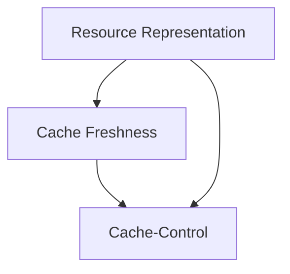

# HTTP Caching Dictionary

A compact example showing how HTTP caching concepts build on one another.

This dictionary is organized in learning order. Follow the sections from top to bottom; prerequisite concepts appear before the concepts that depend on them.

<!-- topic-dictionary:index:start -->
## Learning path

### 1. Foundations

- [Resource Representation](concepts/resource-representation.md) — A representation is the transferable form of a resource that an HTTP cache can store and reuse.

### 2. Caching Mechanics

- [Cache Freshness](concepts/cache-freshness.md) — Freshness determines whether a stored response may satisfy a request without contacting the origin server.
- [Cache-Control](concepts/cache-control.md) — Cache-Control carries directives that constrain where an HTTP response is stored and how it is reused.
<!-- topic-dictionary:index:end -->

<!-- topic-dictionary:graph:start -->
## Concept graph

<!-- topic-dictionary:graph:end -->
